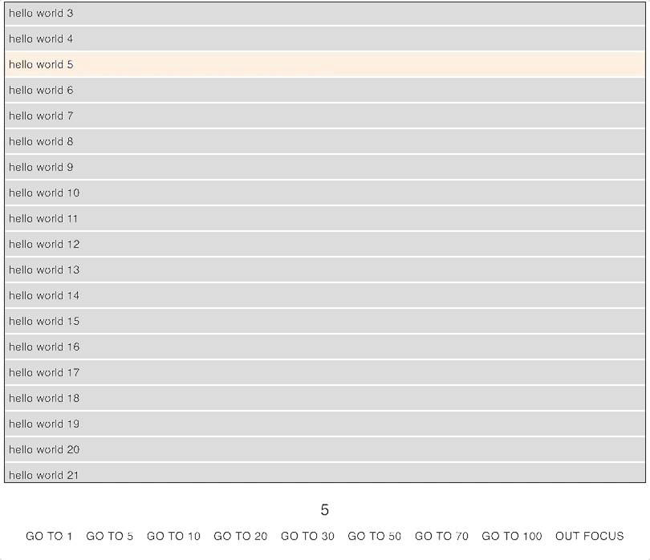

## Scrolling Example

### how to start project

```shell script
$ git clone https://github.com/tisstp/react-tsx-test-scrolling.git
$ cd react-tsx-test-scrolling
$ yarn
$ yarn start
```

### Screen

